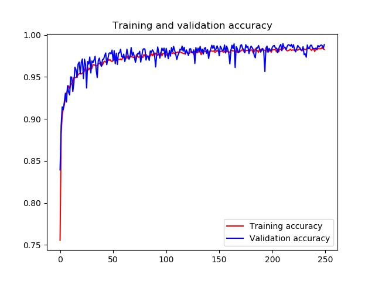
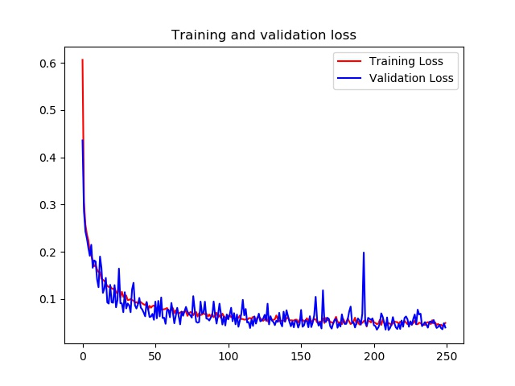

<h1>
<a href="https://www.linkedin.com/in/bongsang/">
</a>
Similarity Searching and Ranking
</h1>

## Usage: Training
#### Everything is automated. 
- You don't need to any manual configuration. Just enter python main.py
```python
python main.py  # donwload, dataset configuration, training and model saving
python main.py --epochs=100
python main.py --epochs=100 --batch_size=64
main_training.py
```

## Usage: Predicting
### Please place test images that you want to inspect in tests directory
```python
python main_predict.py # There are some images for testing in tests directory default.
python main.py --test_path=your/directory  # You can change default test directory
```

## Training results




# Enjoy!
