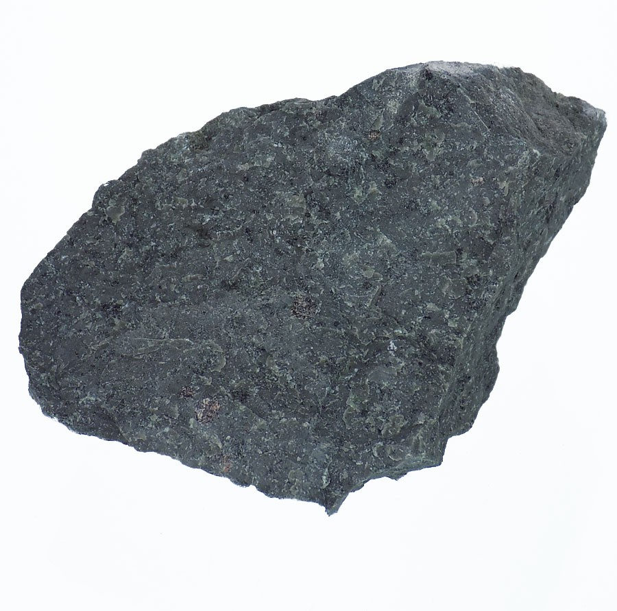
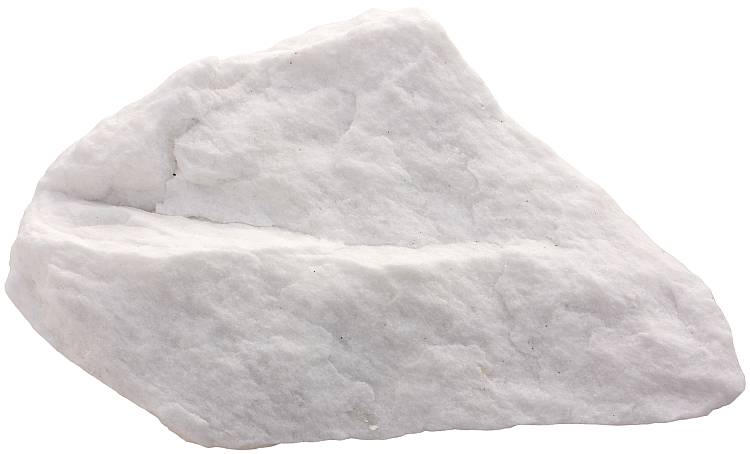
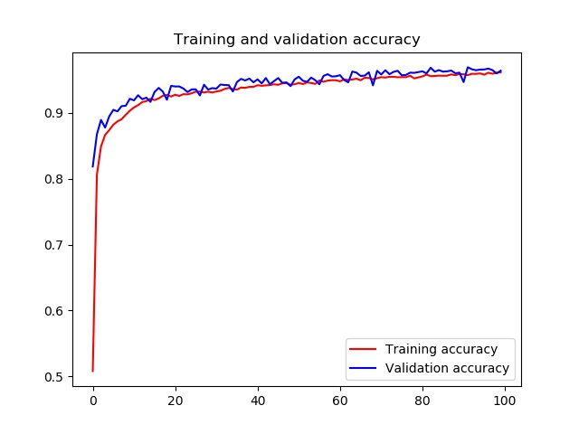
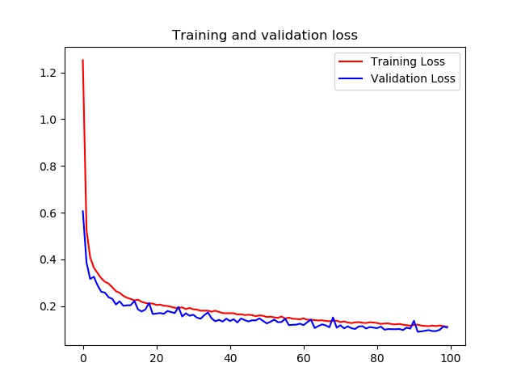

<h1>
<a href="https://www.linkedin.com/in/bongsang/">
</a>
Geological Multi Classification
</h1>


## Amazon
  

## Usage: Training
```python
python main.py
python main.py --epochs=100
python main.py --epochs=100 --batch_size=64
# You can seen various options in main.py source code.
```

## Usage: Predicting
### Please place test images that you want to inspect in tests directory
```python
python main_predict.py # There are some images for testing in tests directory default.
python main.py --test_path=your/directory  # You can change default test directory
```

## Training results




# Thank you!
